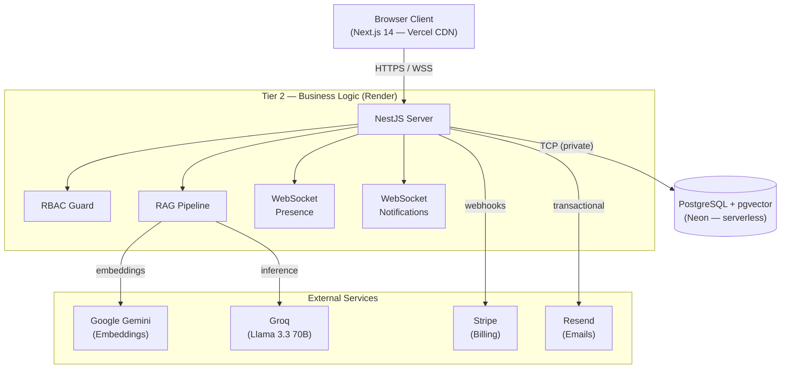
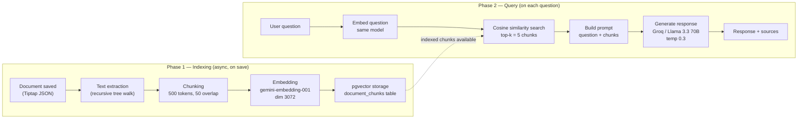

# DocuMind

**Multi-Workspace Document Management Platform with AI-Powered Chat and Real-Time Collaboration**

DocuMind is a full-stack SaaS platform that lets teams organize, search, and collaborate on
documents, with an AI assistant that answers questions grounded in your actual files using a
RAG pipeline. Built as my final-year engineering project (PFE) during my internship at
Trinovatech, awarded highest distinction on defense.

---

## Overview

Every team eventually hits the same wall: documents pile up across folders, and finding or
reasoning over them becomes slow and unreliable. DocuMind combines a permission-aware document
workspace with a Retrieval-Augmented Generation (RAG) pipeline so users can chat with a single
document, a selection of documents, or an entire workspace, and get answers grounded in the
actual content with traceable sources.

The system is built for production: multi-tenant data isolation, real-time collaborative
editing, subscription billing, and a full CI/CD pipeline.

---

## Core Features

### Multi-Workspace Access Control (RBAC)
- Workspace-based multi-tenancy with data fully isolated per workspace, folder, and member
- Granular role hierarchy (Owner, Admin, Editor, Reader) enforced at the API and query level
- Email invitation system for onboarding teammates with a predefined role

### AI Assistant (RAG Pipeline)
- Chat with a **single document**, a **selection of documents**, or an **entire workspace**
- Hybrid search combining `pgvector` semantic similarity with PostgreSQL full-text search
- Embeddings via Google Gemini, inference via Groq (Llama 3.3 70B) for low-latency responses
- Answers are grounded in retrieved chunks, with source documents always traceable
- AI-powered inline actions: summarize, simplify, rewrite, translate selected text
- AI document generation from a natural language description

### Real-Time Collaboration
- Multi-user collaborative document editing built on TipTap
- Live presence indicators and edit locking powered by Socket.IO
- Comments and @mentions with real-time notifications

### Document Management
- Folder-based organization with version history and one-click restore
- Import from PDF, Word, Excel, and image (with AI-based content extraction)
- Export to PDF, Word, or Excel
- Public share links with optional expiration, no login required

### Subscription Billing
- Stripe integration with Free, Pro, and Enterprise tiers
- Plan-gated features and usage limits enforced server-side

### Platform
- Admin activity logs filterable by member, action type, and date, with CSV export
- Multilingual interface: French, English, and Arabic with full RTL support
- PWA support for installable, app-like access on desktop and mobile
- Admin dashboard with workspace usage statistics

---

## Tech Stack

| Layer | Technology |
|---|---|
| Frontend | Next.js 14, React, TypeScript, Tailwind CSS v4, Radix UI, Zustand, TanStack Query |
| Backend | NestJS, TypeScript, REST API, Socket.IO |
| Database | PostgreSQL + `pgvector`, Prisma ORM |
| AI / RAG | Google Gemini (embeddings), Groq / Llama 3.3 70B (inference), hybrid vector + full-text |
| Payments | Stripe (subscriptions, webhooks) |
| Editor | TipTap (rich text, collaborative editing) |
| Infra | Docker, GitHub Actions (CI/CD), Render (backend), Vercel (frontend), Neon (database) |
| Testing | Jest, Vitest, React Testing Library, Playwright (E2E) |

---

## Architecture



### RAG Pipeline Detail



---

## Testing

- **Unit tests**: Jest covering auth, RBAC guards, document service, workspace logic, subscription plans
- **Integration (E2E backend)**: Jest + Supertest against a real PostgreSQL test database, covering auth, documents, workspaces, share links
- **Component tests**: Vitest + React Testing Library across 10 frontend component files
- **E2E (browser)**: Playwright covering auth flows, workspace/document operations, and member invitations

---

## CI/CD

Every push to `main` or `develop` triggers a GitHub Actions pipeline running two parallel jobs:

**Backend CI**: install, Prisma client generation, DB migrations, build, lint, unit tests with
coverage, E2E tests (Supertest), security audit

**Frontend CI**: install, ESLint, production build

On success, CD deploys the backend as a Docker image to Render and the frontend to Vercel, with
a health check after each deployment.

---

## Local Development with Docker

The full stack runs locally with one command:

```bash
docker compose up
```

This starts three containers (PostgreSQL with pgvector, NestJS backend, Next.js frontend)
matching the production topology, removing environment drift between machines.

---

## Project Context

DocuMind was built as my End-of-Studies Project (PFE) for my Software Engineering degree at EPI
International Multidisciplinary School, developed during my internship at Trinovatech. Awarded
highest distinction on academic defense.

---

## License

All rights reserved. See [LICENSE](./LICENSE).

---

## Contact

**Safwen Ben Mabrouk** — Full-Stack Software Engineer
- Email: safwenbenmabrouk@gmail.com
- LinkedIn: [linkedin.com/in/safwen-ben-mabrouk](https://linkedin.com/in/safwen-ben-mabrouk)
- GitHub: [@Safwen-bm](https://github.com/Safwen-bm)